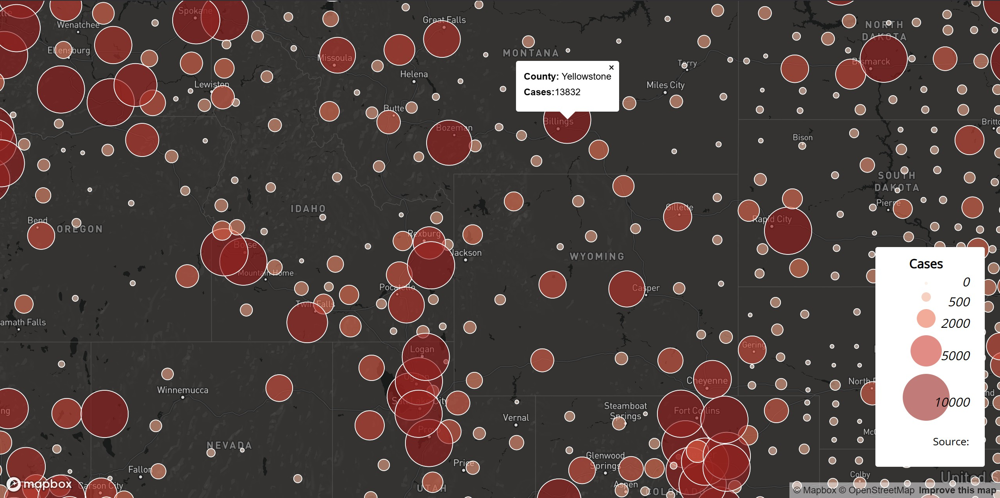
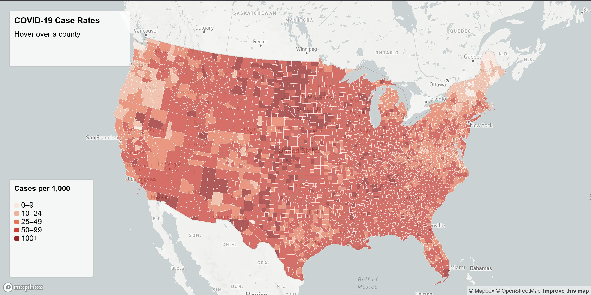

# Covid-19 Counts and Rates in 2020

This project includes two maps visualizing Covid-19 in the United States. Both maps are interactive. 

## Primary Functions
- Color Ramp to display ranges of data
- Interactive Map with addtional data when hovering over counties
- The Albers projection was used on the choropleth map
- Proportional Sizing of circles to display distribution

## Proportional Symbol Map

[Link to Proportional Symbols Map](https://github.com/macklin-farrell/CovidMaps2020/tree/main/js/Covid2020Symbols.html)

## Choropleth Map

[Link To Choropleth Map](https://github.com/macklin-farrell/CovidMaps2020/tree/main/js/Covid2020Choropleth.html)

## Sources
- New York Times
- U.S. Census Bureau
- 2018 ACS 5-Year Estimate
- Mapshaper
- Mapbox

